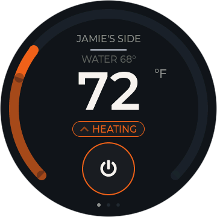
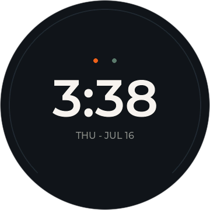
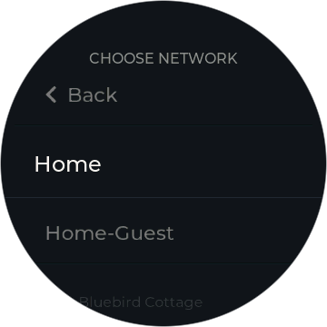
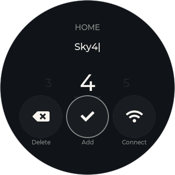
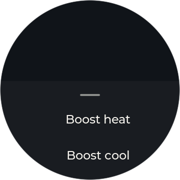
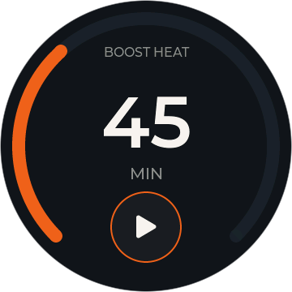
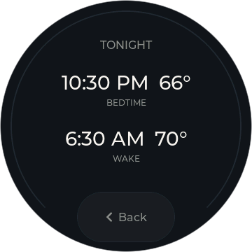
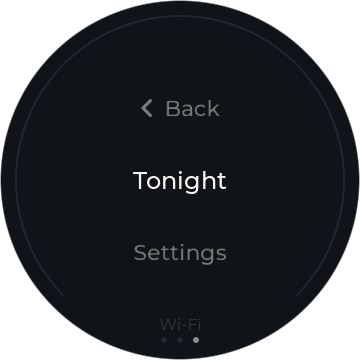
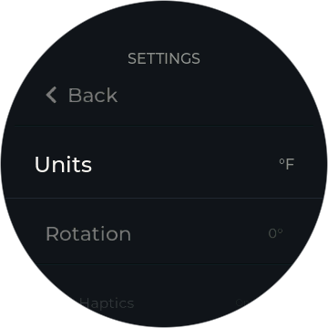

# orion-waveshare-rotary-dial

> **Not affiliated with, endorsed by, or supported by Orion Sleep or Waveshare.**
> This is an independent, community-built project.

Turn a knob to change the temperature of your side of the bed. This project
turns a **Waveshare ESP32-S3 round touch-LCD knob** into a standalone bedside
dial for an **[Orion Sleep](https://orionsleep.com) dual-zone mattress
topper** — no phone app, no hub on your network, no cloud service to run
yourself. The dial talks to Orion directly, over Wi-Fi you already have.

<p align="center">
  
  
  
</p>

<!-- TODO: photo of the flashed dial on a nightstand -->

## Hardware required

- **Waveshare ESP32-S3-Knob-Touch-LCD-1.8** — the round 1.8" touch-LCD knob
  board (ESP32-S3, rotary encoder + capacitive touch + haptics). See
  [firmware/README.md](firmware/README.md) for the full parts table.
- An Orion Sleep dual-zone topper on the same 2.4 GHz Wi-Fi network, and an
  Orion account.

One dial covers one side of the bed; run two if you want independent control
of both zones.

## Quick start

Everything else — Wi-Fi setup, pairing your Orion account, choosing a side —
happens on the device itself after first boot.

**Option 1: Flash from your browser.** Open
[https://chris023.github.io/orion-waveshare-rotary-dial/](https://chris023.github.io/orion-waveshare-rotary-dial/)
in Chrome or Edge, plug the dial in over USB-C (no port showing up? rotate
the connector 180° in the dial's own socket — same cable end, just upside
down; the board reaches a different chip in each orientation), and click
Install. Everything else happens on the dial's screen.

**Option 2: Build from source.**

```bash
idf.py set-target esp32s3
idf.py build
idf.py -p <PORT> flash
```

That needs **ESP-IDF v6.0** installed first. Full build/flash instructions,
board bring-up notes, and firmware architecture live in
[firmware/dial-idf/README.md](firmware/dial-idf/README.md).

## Features

- **On-device setup** — Wi-Fi and Orion pairing both happen right on the
  dial. No app, no computer, no config file.
- **Scan-and-approve Orion pairing** — a QR code opens Orion's consent page
  in your phone's browser; the dial registers itself as an OAuth client on
  the spot (Dynamic Client Registration) — no shared secret baked into the
  firmware.
- **Dual-zone control** with a side picker, so one dial can drive either
  half of the bed.
- **°F or °C**, your choice, in settings.
- **Haptic detents** on every knob turn, with a distinct stop pulse at the
  ends of a range.
- **Day/night palette** that shifts with the clock, and a **standby clock
  face** for when it's idle.
- **OTA updates** straight from this repo's GitHub Releases, with
  bootloader rollback if one goes bad.
- **Factory reset** — tap-twice-confirm to unpair and start clean.

## Screens

<table>
<tr>
<td align="center"></td>
<td align="center"></td>
<td align="center"></td>
<td align="center"></td>
</tr>
<tr>
<td align="center">First boot</td>
<td align="center">Join Wi-Fi</td>
<td align="center">Type a password</td>
<td align="center">Pair with Orion</td>
</tr>
<tr>
<td align="center"></td>
<td align="center"></td>
<td align="center"></td>
<td align="center"></td>
</tr>
<tr>
<td align="center">Pick your side</td>
<td align="center">The dial</td>
<td align="center">Quick actions</td>
<td align="center">Boost</td>
</tr>
<tr>
<td align="center"></td>
<td align="center"></td>
<td align="center"></td>
<td align="center"></td>
</tr>
<tr>
<td align="center">Tonight's schedule</td>
<td align="center">Menu</td>
<td align="center">Settings</td>
<td align="center">Standby clock</td>
</tr>
</table>

### Preview the UI without hardware

Every screenshot above is a pixel-exact render of the real firmware UI,
produced by the simulator in [`simulator/`](simulator/) — no board required:

```bash
cmake -B build -S simulator
cmake --build build
```

Run the resulting binary; PNGs land in `docs/screens/`. See
[simulator/README.md](simulator/README.md) for details.

## Repo layout

- [`firmware/dial-idf/`](firmware/dial-idf/) — the product: the ESP-IDF (C)
  firmware that actually ships.
- Earlier prototypes (a TypeScript/Node hub, a Moddable display attempt,
  hardware bring-up probes) have been removed from the tree; they're
  preserved in this repo's git history, not needed to build or run the dial.

## License

[PolyForm Noncommercial 1.0.0](LICENSE) © 2026 Chris Meyer. Free to use,
build, modify, and share for **personal and other noncommercial
purposes**. Any commercial use — selling devices or software built on
this project, or using it in or for a business — requires a separate
commercial license: open a GitHub issue to ask. Third-party components
used by the firmware are under their own licenses — see
[THIRD_PARTY_LICENSES.md](THIRD_PARTY_LICENSES.md).

## Contributing

Contributions are welcome. By submitting one you agree it's licensed to
the project maintainer under terms that let the project be licensed as
above, including commercially.
